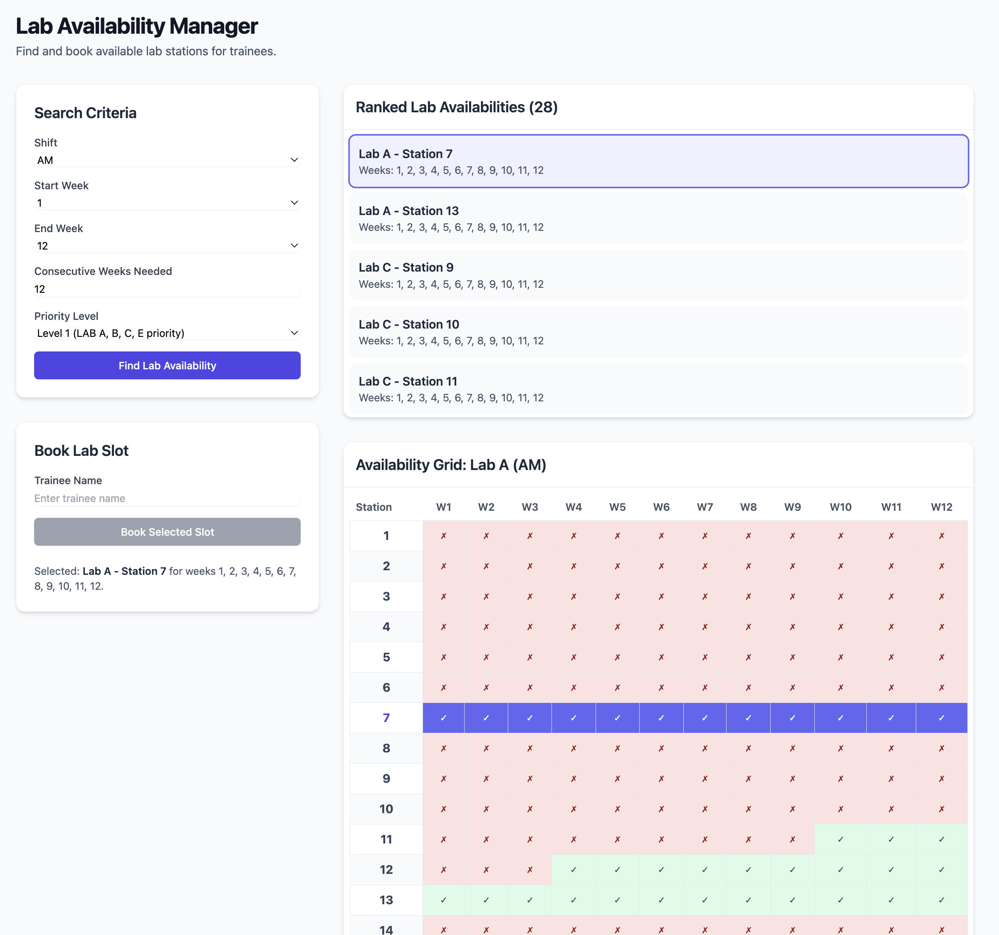

# Smart Lab Availability Manager

This project allows you to edit an Excel file stored in OneDrive, find available slots, and book them.

## Running with Docker

This project is fully containerized and can be run using Docker and Docker Compose. We have separate configurations for local development and production environments.

### Local Development

For local development, we use a setup that includes hot-reloading for both the frontend and backend. This means that any changes you make to the code will be reflected instantly without needing to restart the containers.

**To run the application in development mode:**

1.  **Build and start the containers:**
    ```sh
    docker-compose -f docker-compose.dev.yml up --build
    ```

2.  **Access the services:**

    *   **Frontend:** [http://localhost:5173](http://localhost:5173)
    *   **Backend:** [http://localhost:5000](http://localhost:5001)

### Production

For production, we use a multi-stage Docker build to create lean, optimized images. The frontend is served by Nginx, and the backend runs a production-ready Node.js server.

**To run the application in production mode:**

1.  **Build and start the containers:**
    ```sh
    docker-compose -f docker-compose.prod.yml up --build -d
    ```

2.  **Access the application:**

    *   You can access the application at [http://localhost](http://localhost) (port 80).

### Stopping the Application

To stop the application, run the following command, making sure to use the same `-f` arguments you used to start it:

**For development:**
```sh
docker-compose -f docker-compose.dev.yml down
```

**For production:**
```sh
docker-compose -f docker-compose.prod.yml down
```

## Local Setup (Without Docker)

To run the application locally without Docker, you'll need to run the frontend and backend services in separate terminals.

**1. Run the Backend:**

```sh
# Navigate to the backend directory
cd backend

# Install dependencies
npm install

# Start the backend development server
npm run dev
```

Your backend API will be running at `http://localhost:5001`.

**2. Run the Frontend:**

```sh
# In a new terminal, navigate to the frontend directory
cd frontend

# Install dependencies
npm install

# Build the frontend
npm run build

# Start the frontend development server
npm start
```

Your frontend application will be running at `http://localhost:5173`.

The app looks something like this.

### App Screenshot
